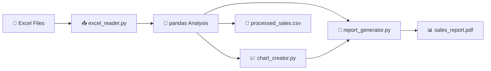

<p align="center">
  <h1 align="center">📊 SalesBot — Automated Sales Report Generator</h1>
  <p align="center">
    <em>An enterprise-grade automation tool that transforms raw Excel sales data into professional PDF reports and actionable CSV summaries.</em>
  </p>
  <p align="center">
    <a href="https://github.com/BATTLEMETAL/SalesBot/actions/workflows/ci.yml"></a>
    
    
    
    
  </p>
</p>

---

## 🎯 Problem Statement

Sales operations teams frequently struggle with the manual overhead of aggregating raw Excel spreadsheets. This manual workflow is not only time-consuming but introduces significant risks of human error during data consolidation and visualization.

## 💡 Solution

**SalesBot** provides a robust, automated pipeline to streamline reporting:

1. **Data Ingestion**: High-performance parsing of `.xlsx` files using `pandas` and `openpyxl`.
2. **Data Analysis**: Automated aggregation, regional grouping, and statistical calculation.
3. **Visualization**: Dynamic generation of professional-grade bar charts via `matplotlib`.
4. **Reporting**: Automated PDF document assembly using `ReportLab`.
5. **Export**: Standardized CSV output for downstream BI integration.

---

## 🏗️ Architecture



---

## 📂 Project Structure

```
SalesBot/
├── main.py               # Pipeline orchestration
├── excel_reader.py        # Data ingestion logic
├── report_generator.py    # PDF layout engine
├── chart_creator.py       # Visualization module
├── tests/                 # Unit and integration tests
├── .github/workflows/     # CI/CD pipeline configuration
└── data/                  # Input directory
```

---

## 🛠️ Tech Stack

| Layer | Technology |
| :--- | :--- |
| **Core Engine** | Python 3.10+ |
| **Data Processing** | pandas, openpyxl, numpy |
| **PDF Generation** | ReportLab |
| **Visualization** | matplotlib, seaborn |
| **Testing** | pytest, tox |
| **CI/CD** | GitHub Actions |

---

## 🧪 Testing

The project maintains a comprehensive test suite to ensure data integrity and pipeline stability. To run the tests:

```bash
pip install pytest
pytest tests/
```

---

## 🚀 Quick Start

```bash
# Clone the repository
git clone https://github.com/BATTLEMETAL/SalesBot.git
cd SalesBot

# Install dependencies
pip install -r requirements.txt

# Execute the pipeline
python main.py
```

---

## 🔗 Related Projects

* [**Synapsa**](https://github.com/BATTLEMETAL/Synapsa) — An advanced data intelligence platform for predictive sales forecasting and trend analysis.

---

## 📜 License

MIT License
