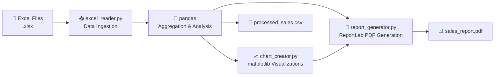

<p align="center">
  <h1 align="center">📊 SalesBot — Automated Sales Report Generator</h1>
  <p align="center">
    <em>Reads Excel sales data, generates PDF reports with visualizations, and exports CSV summaries — fully automated.</em>
  </p>
  <p align="center">
    
    
    
    
  </p>
</p>

---

## 🎯 Problem

Sales teams often receive raw data in Excel spreadsheets that need to be manually aggregated, visualized, and formatted into presentable reports. This process is repetitive, error-prone, and time-consuming.

## 💡 Solution

**SalesBot** automates the entire reporting pipeline:

1. **📥 Data Ingestion** — Reads multiple Excel files (`.xlsx`) using `openpyxl` and `pandas`
2. **📊 Aggregation** — Groups data by region, calculates totals and averages
3. **📈 Visualization** — Generates bar charts with `matplotlib`
4. **📄 PDF Report** — Creates formatted PDF reports using `ReportLab` with tables and charts
5. **💾 CSV Export** — Exports processed data for further analysis

---

## 🏗️ Architecture



---

## 📂 Project Structure

```
SalesBot/
├── main.py               # Entry point — orchestrates the full pipeline
├── excel_reader.py        # Excel file reading + data processing
├── report_generator.py    # PDF report generation (ReportLab)
├── chart_creator.py       # Bar chart creation (matplotlib)
└── data/                  # Input Excel files directory
```

---

## 🛠️ Tech Stack

| Component | Technology |
|-----------|------------|
| **Data Processing** | pandas, openpyxl |
| **PDF Generation** | ReportLab |
| **Visualization** | matplotlib |
| **Export** | CSV (pandas) |

---

## 🚀 Quick Start

```bash
# Clone
git clone https://github.com/yourusername/salesbot.git
cd salesbot

# Install dependencies
pip install pandas openpyxl reportlab matplotlib

# Place your Excel files in data/
# Run the pipeline
python main.py
```

### Output
- `sales_report.pdf` — Formatted PDF with regional sales breakdown
- `sales_chart.png` — Bar chart visualization
- `processed_sales.csv` — Clean aggregated data

---

## 📜 License

MIT License
